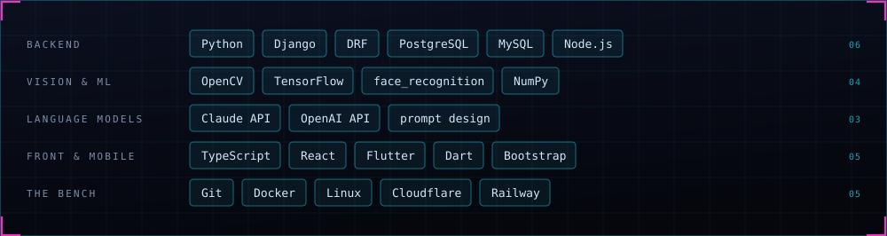

<picture>
  <source media="(prefers-color-scheme: dark)" srcset="./assets/hud-dark.svg">
  <source media="(prefers-color-scheme: light)" srcset="./assets/hud-light.svg">
  
</picture>

 

**AI systems · computer vision · full-stack platforms**

 

### ▸ &nbsp;now

I build AI-assisted business systems: the internal platform nobody outside the company ever sees, the camera that reads a plate at speed, the dashboard someone actually opens on a Monday morning. Django underneath, computer vision on one side, language models on the other.

Both ends are the same problem. Take a messy input — a blurred frame, a half-finished sentence, a form filled in wrong — and return something a person can act on without checking it twice.

I work across Arabic, English, French and Chinese, which is decent training for the job: most of the difficulty is translation, and most of the bugs are somebody assuming they were understood.

 

### ▸ &nbsp;stack

<picture>
  <source media="(prefers-color-scheme: dark)" srcset="./assets/stack-dark.svg">
  <source media="(prefers-color-scheme: light)" srcset="./assets/stack-light.svg">
  
</picture>

 

### ▸ &nbsp;detections

<table>
<tr>
<td width="50%" valign="top">

#### Vehicle Speed &amp; Plate Recognition

Reading a road from video: tracking vehicles across frames to estimate speed, then pulling the plate out of a moving, badly-lit, rarely-cooperative image. Most of the work is the frames where it *shouldn't* fire.

`0.97` &nbsp; Python · OpenCV · TensorFlow

</td>
<td width="50%" valign="top">

#### AI-Powered Enterprise OS

The system a company runs its day on — orders, stock, staff, reporting — with an assistant living inside it that answers questions about the business rather than about the manual.

`0.96` &nbsp; Django · PostgreSQL · LLM APIs

</td>
</tr>
<tr>
<td width="50%" valign="top">

#### Face Recognition Attendance

Attendance that takes itself. Students enrol once, the system encodes their face, and from then on a webcam handles check-in and check-out — timestamped rows, organised by department and class.

`0.95` &nbsp; Django · OpenCV · face_recognition · NumPy

</td>
<td width="50%" valign="top">

#### Virtual Hair Colour Try-On

Segment the hair, keep the highlights, change the colour — and have it still look like hair rather than a paint bucket. Vision work where the acceptance test is the human eye.

`0.93` &nbsp; Python · OpenCV · image segmentation

</td>
</tr>
<tr>
<td width="50%" valign="top">

#### Multilingual E-Commerce Platform

Catalogue, media, orders, and translations that hold up across languages — plus an admin the client can actually run without me.

`0.92` &nbsp; Django · PostgreSQL · i18n

</td>
<td width="50%" valign="top">

#### Offline Recipe Keeper

A Flutter app that works on a train with no signal. Local storage, a clean interface, nothing that phones home to be useful.

`0.90` &nbsp; Flutter · Dart · local storage

</td>
</tr>
</table>

Some commercial and client work is maintained privately. If something here is close to what you're building, ask — I'm happy to walk you through it.

 

<b>▸ &nbsp;false positives</b>

 

Things this profile will confidently misclassify:

`0.91` — **"Django developer."** True, but the interesting half of the job happens before a request ever reaches a view.

`0.88` — **"AI guy."** Most of what I ship is plumbing. The model is usually the smallest file in the repo, and the part I spend least time on.

`0.74` — **"just passing through."** Morocco to China was not a layover.

The banner at the top is hand-written SVG — the bounding box, the scanline, the reticle, every tick on that ruler. No images, no libraries, no third-party widgets that break when someone else's free tier expires. It re-renders from one script, so the light and dark versions can't drift apart.

 

### ▸ &nbsp;contact

<a href="https://github.com/angorot89?tab=repositories"><b>Repositories →</b></a>

Open to ambitious products and difficult problems. Learn fast, build smart, ship useful things.
