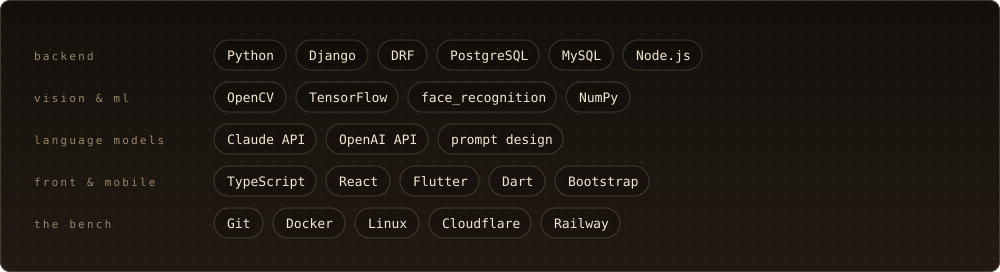

<picture>
  <source media="(prefers-color-scheme: dark)" srcset="./assets/night-desk-dark.svg">
  <source media="(prefers-color-scheme: light)" srcset="./assets/night-desk-light.svg">
  
</picture>

 

*Morocco → China · building things that see, decide, and stay out of the way*

 

### ✦ &nbsp;now

I build AI-assisted business systems: the internal platform nobody outside the company ever sees, the camera that reads a plate, the dashboard someone actually opens on a Monday morning. Most of it is Django underneath — models, migrations, querysets, the seam where a form becomes a row in Postgres — with computer vision on one side and language models on the other.

Both ends are the same job, really. Take a messy input. Return something a person can trust.

I work between Arabic, English, French and Chinese, which turns out to be good training for software: most of the difficulty is translation, and most of the bugs are somebody assuming they were understood.

 

### ✦ &nbsp;the workshop

<picture>
  <source media="(prefers-color-scheme: dark)" srcset="./assets/workshop-dark.svg">
  <source media="(prefers-color-scheme: light)" srcset="./assets/workshop-light.svg">
  
</picture>

 

### ✦ &nbsp;selected work

<table>
<tr>
<td width="50%" valign="top">

#### Face Recognition Attendance

Attendance that takes itself. Students are enrolled once — the system captures and encodes their face — and from then on a webcam handles check-in and check-out, writing timestamped rows organised by department and class.

Django · OpenCV · face_recognition · NumPy

</td>
<td width="50%" valign="top">

#### Vehicle Speed & Plate Recognition

Reading a road from video: tracking vehicles across frames to estimate speed, and pulling the plate out of a moving, badly-lit, rarely-cooperative image.

Python · OpenCV · TensorFlow

</td>
</tr>
<tr>
<td width="50%" valign="top">

#### AI-Powered Enterprise Operating System

The system a company runs its day on — orders, stock, staff, reporting — with an AI assistant sitting inside it that can answer questions about the business instead of just about the manual.

Django · PostgreSQL · LLM APIs

</td>
<td width="50%" valign="top">

#### Virtual Hair Colour Try-On

Segment the hair, keep the highlights, change the colour — and have it still look like hair rather than a paint bucket. Vision work where the bar is set by the human eye.

Python · OpenCV · image segmentation

</td>
</tr>
<tr>
<td width="50%" valign="top">

#### Multilingual E-Commerce Platform

A storefront built the boring, durable way: catalogue, media, orders, and translations that hold up across languages — plus an admin the client can actually run without me.

Django · PostgreSQL · i18n

</td>
<td width="50%" valign="top">

#### Offline Recipe Keeper

A Flutter app that works on a train with no signal. Local storage, a clean interface, and nothing that phones home to be useful.

Flutter · Dart · local storage

</td>
</tr>
</table>

Some commercial and client work is maintained privately. If something here is close to what you're building, ask me — I'm happy to walk you through it.

 

<b>☕ &nbsp;what's actually in the mug</b>

 

Nous-nous, when I can get it. I'm a long way from the café that makes it properly, so most nights it's whatever's closest — and it goes cold anyway, about twenty minutes into a bug.

The illustration at the top of this page is hand-written SVG — every rain streak, every bulb on that string, the lamp's flicker, the cat's slow breathing. No image files, no animation library, about a thousand lines of geometry. It rains up there whether or not anyone is watching.

 

### ✦ &nbsp;elsewhere

<a href="https://github.com/angorot89?tab=repositories"><b>My repositories →</b></a>

Learn fast. Build smart. Ship useful things. Open to ambitious products and difficult problems — the lamp's on.
