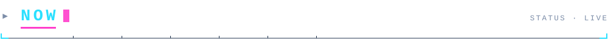
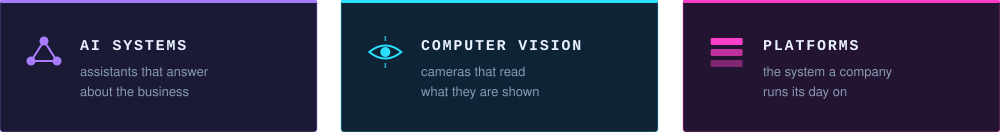
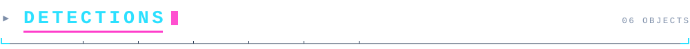

<picture>
  <source media="(prefers-color-scheme: dark)" srcset="./assets/hud-dark.svg">
  <source media="(prefers-color-scheme: light)" srcset="./assets/hud-light.svg">
  
</picture>

 

**AI systems · computer vision · full-stack platforms**

 

<picture>
  <source media="(prefers-color-scheme: dark)" srcset="./assets/sec-now-dark.svg">
  <source media="(prefers-color-scheme: light)" srcset="./assets/sec-now-light.svg">
  
</picture>

<picture>
  <source media="(prefers-color-scheme: dark)" srcset="./assets/caps-dark.svg">
  <source media="(prefers-color-scheme: light)" srcset="./assets/caps-light.svg">
  
</picture>

I build AI-assisted business systems: the internal platform nobody outside the company ever sees, the camera that reads a plate at speed, the dashboard someone actually opens on a Monday morning. Django underneath, computer vision on one side, language models on the other.

Both ends are the same problem. Take a messy input — a blurred frame, a half-finished sentence, a form filled in wrong — and return something a person can act on without checking it twice.

> I work across Arabic, English, French and Chinese, which is decent training for the job: most of the difficulty is translation, and most of the bugs are somebody assuming they were understood.

 

<picture>
  <source media="(prefers-color-scheme: dark)" srcset="./assets/sec-stack-dark.svg">
  <source media="(prefers-color-scheme: light)" srcset="./assets/sec-stack-light.svg">
  
</picture>

<picture>
  <source media="(prefers-color-scheme: dark)" srcset="./assets/stack-dark.svg">
  <source media="(prefers-color-scheme: light)" srcset="./assets/stack-light.svg">
  
</picture>

 

<picture>
  <source media="(prefers-color-scheme: dark)" srcset="./assets/sec-detections-dark.svg">
  <source media="(prefers-color-scheme: light)" srcset="./assets/sec-detections-light.svg">
  
</picture>

<picture>
  <source media="(prefers-color-scheme: dark)" srcset="./assets/cards-dark.svg">
  <source media="(prefers-color-scheme: light)" srcset="./assets/cards-light.svg">
  
</picture>

Some commercial and client work is maintained privately. If something here is close to what you're building, ask — I'm happy to walk you through it.

 

<b>▸ &nbsp;false positives</b>

 

Things this profile will confidently misclassify:

`0.91` — **"Django developer."** True, but the interesting half of the job happens before a request ever reaches a view.

`0.88` — **"AI guy."** Most of what I ship is plumbing. The model is usually the smallest file in the repo, and the part I spend least time on.

`0.74` — **"just passing through."** Morocco to China was not a layover.

The banner at the top is hand-written SVG — the bounding box, the scanline, the reticle, every tick on that ruler. No images, no libraries, no third-party widgets that break when someone else's free tier expires. It re-renders from one script, so the light and dark versions can't drift apart.

 

<picture>
  <source media="(prefers-color-scheme: dark)" srcset="./assets/sec-contact-dark.svg">
  <source media="(prefers-color-scheme: light)" srcset="./assets/sec-contact-light.svg">
  
</picture>

<a href="https://github.com/angorot89?tab=repositories"><b>Repositories →</b></a>

Open to ambitious products and difficult problems. Learn fast, build smart, ship useful things.
